# Full-Bleed Templates

Full-screen image display templates optimized for showcasing photos without metadata or UI clutter.

> [!IMPORTANT]  
> Must use polling url with `adaptive_background` parameter to enable background color adaptation.

## Purpose

These templates prioritize **image-first display**, removing titles, captions, metadata, and year overlays to create a seamless full-screen photo experience on TRMNL devices.

### When to Use Full-Bleed Templates

✅ **Use these templates if you want:**

- Full-screen centered images with minimal UI
- Clean, distraction-free photo display
- Adaptive background colors that blend with photo edges
- Focus on the photo itself, not metadata

❌ **Use the standard templates if you want:**

- Photo metadata (date, size, photo count) in title bar
- Photo captions and descriptions
- Year display overlay
- Photo count badges

## What's Different

### Full-Bleed Templates (`templates-fullbleed/`)

- **Full-screen layout** — Photos fill the entire display area
- **Centered images** — Photos are centered both horizontally and vertically
- **No metadata** — Title bar, captions, and overlays are removed
- **Adaptive backgrounds** — Background color matches image brightness (16 shades)
- **Image dithering** — Optimal quality on monochrome displays
- **Simple error states** — Minimal "No Photos Available" message

## Adaptive Background Feature

Full-bleed templates automatically select a background color based on image brightness:

**Brightness Mapping (0-100 scale → 16 TRMNL shades)**

- `edge_brightness_score` preferred (light background detection)
- `brightness_score` fallback (overall brightness)
- Default: white (`bg--white`) when data unavailable

This creates seamless visual integration where light-colored photos blend smoothly with light backgrounds, and dark photos with dark backgrounds.

### Example

```liquid
<!-- Brightness: 85 → bg--gray-70 -->
<!-- Brightness: 25 → bg--gray-25 -->
<!-- Brightness: undefined → bg--white (default) -->
<div class="layout h--full {{ bg_class }}">
  
</div>
```

## Image Quality

All images include:

- **`image-dither` class** — Creates grayscale illusion on 1-bit (monochrome) displays
- **`image--contain` class** — Maintains aspect ratio without cropping
- **`object-fit: contain`** — Ensures photos fit without distortion

## Configuration

See [custom-fields.yml](custom-fields.yml) for plugin settings:

- `shared_album_url` — Google Photos shared album link
- `adaptive_background` (new) — Enable/disable background color matching
- `enable_caching` — Cache photo data for faster loading

### Polling URL Example

```
https://trmnl-google-photos.gohk.xyz/api/photo?album_url={{ shared_album_url }}&enable_caching={{ enable_caching }}&adaptive_background={{ adaptive_background }}
```

### Visual Comparison

| Standard Recipe                                                   | Full-Bleed                                                         |
| ----------------------------------------------------------------- | ------------------------------------------------------------------ |
| 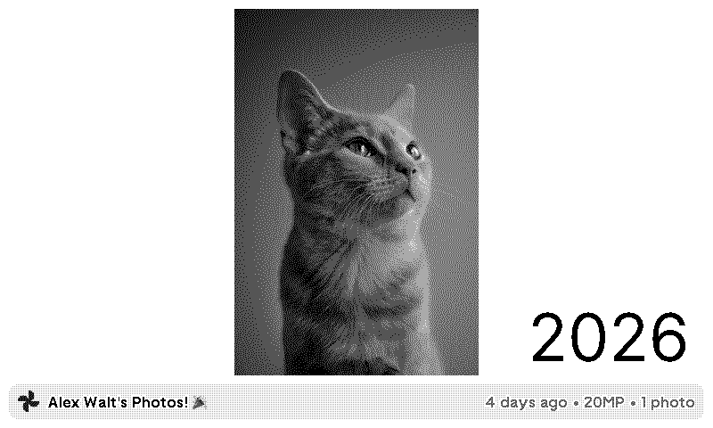         | 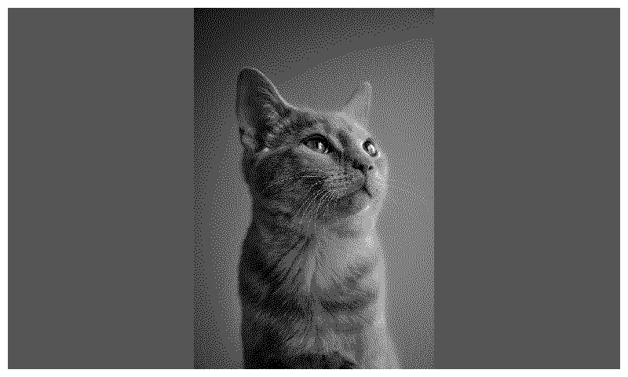           |
| 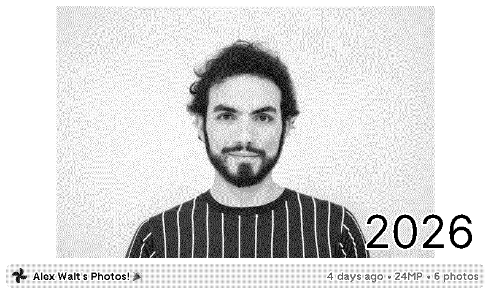 | 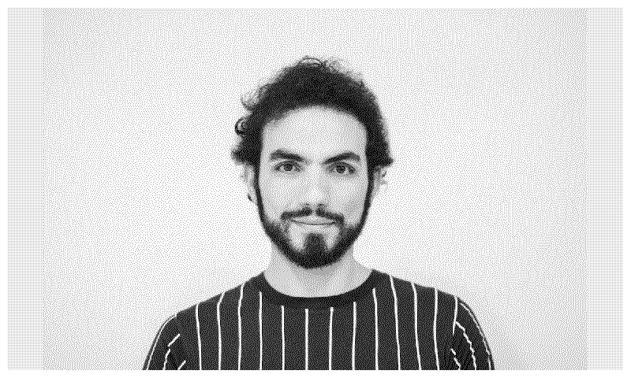 |
| 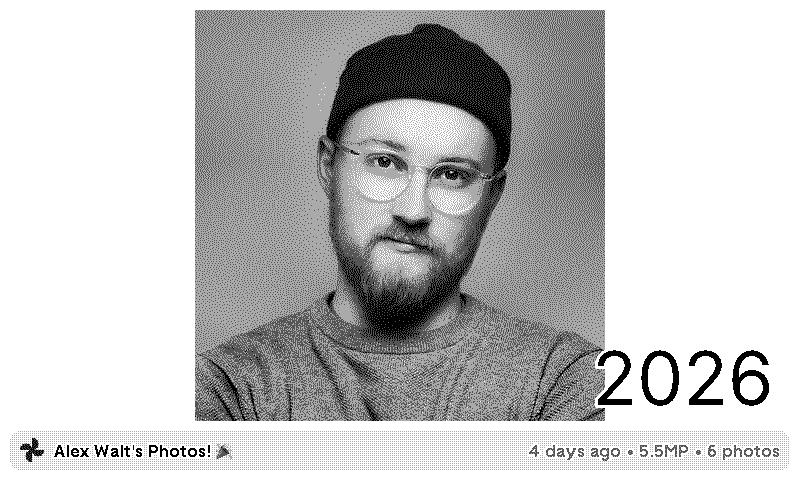 | 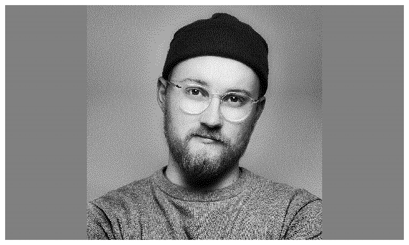 |
|  | 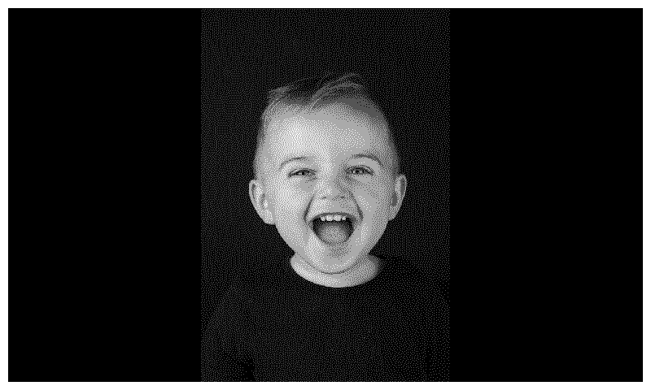 |
| 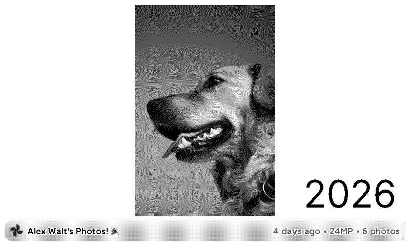      | 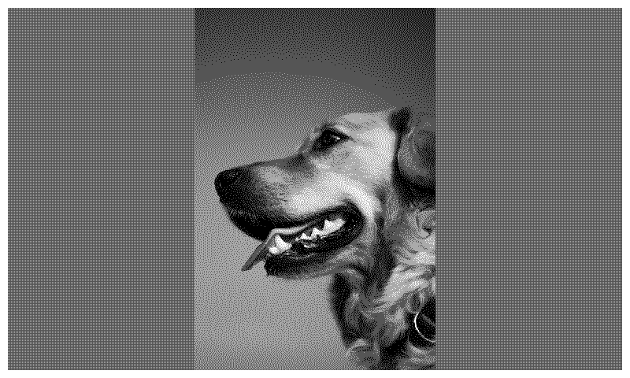      |
| 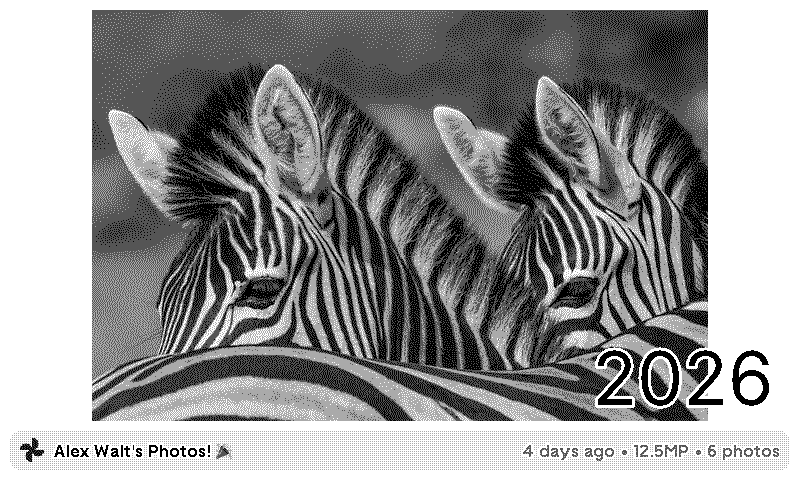       | 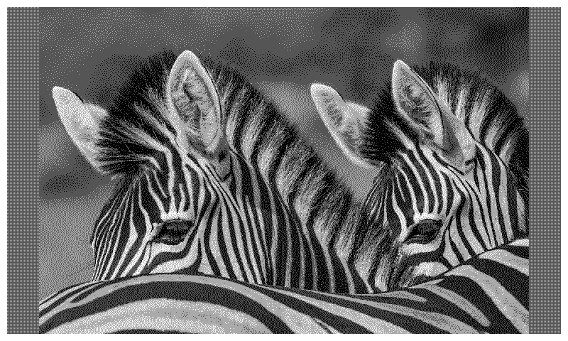       |
