# Google Photos Canvas — Fullscreen Photo Display

A minimalist, distraction-free variant of the Google Photos plugin for TRMNL.

**Install from TRMNL Recipes**: [Google Photos Canvas (Recipe #230712)](https://trmnl.com/recipes/230712)

---

## Overview

Google Photos Canvas displays random photos from your Google Photos shared albums on TRMNL e-ink displays with a focus on **pure photo experience**:

- 📸 **Fullscreen edge-to-edge** photos with no metadata
- 🎨 **Adaptive backgrounds** that match photo brightness
- 🔐 **Privacy-first** — No OAuth, no tracking
- ⚡ **Same fast API** as the Standard variant

**Same backend, different presentation.** Canvas and Standard share the identical Cloudflare Worker API but offer different visual experiences.

## Canvas vs. Standard

| Aspect           | Canvas                                             | Standard                                           |
| ---------------- | -------------------------------------------------- | -------------------------------------------------- |
| **Purpose**      | Photo-focused                                      | Info-rich                                          |
| **Display**      | Edge-to-edge fullscreen                            | Centered with padding                              |
| **Title Bar**    | Removed                                            | Shows custom name, date, count                     |
| **Background**   | Adaptive to photo                                  | Static white                                       |
| **Metadata**     | None                                               | Photo size, megapixels, album info                 |
| **Best For**     | Immersive viewing                                  | Organized information display                      |
| **Install Link** | [Recipe #230712](https://trmnl.com/recipes/230712) | [Recipe #227153](https://trmnl.com/recipes/227153) |

---

---

## Installation

1. Visit [Google Photos Canvas on TRMNL Recipes](https://trmnl.com/recipes/230712)
2. Click **Install** to add the recipe to your TRMNL account
3. Create a shared album in Google Photos
4. Copy the shared album link
5. Paste it in the Canvas plugin settings
6. Add to your TRMNL playlist

**First time?** See [main README](../README.md#-privacy-first) for privacy info and more details.

---

## Features

These templates prioritize **image-first display**, removing titles, captions, metadata, and year overlays to create a seamless full-screen photo experience on TRMNL devices.

### Why Canvas?

✅ **Use Canvas if you want:**

- Full-screen centered images with minimal UI
- Clean, distraction-free photo display
- Adaptive background colors that blend with photo edges
- Focus on the photo itself, not metadata

✅ **Use Standard if you want:**

- Photo metadata (date, size, photo count) in title bar
- Photo captions and descriptions
- Year display overlay
- Photo count badges

## What's Different

### Full-Bleed Templates (`templates-fullbleed/`)

- **Full-screen layout** — Photos fill the entire display area
- **Centered images** — Photos are centered both horizontally and vertically
- **No metadata** — Title bar, captions, and overlays are removed
- **Adaptive backgrounds** — Background color matches image brightness (16 shades)
- **Image dithering** — Optimal quality on monochrome displays
- **Simple error states** — Minimal "No Photos Available" message

## Adaptive Background Feature

Full-bleed templates automatically select a background color based on image brightness:

**Brightness Mapping (0-100 scale → 16 TRMNL shades)**

- `edge_brightness_score` preferred (light background detection)
- `brightness_score` fallback (overall brightness)
- Default: white (`bg--white`) when data unavailable

This creates seamless visual integration where light-colored photos blend smoothly with light backgrounds, and dark photos with dark backgrounds.

### Example

```liquid
<!-- Brightness: 85 → bg--gray-70 -->
<!-- Brightness: 25 → bg--gray-25 -->
<!-- Brightness: undefined → bg--white (default) -->
<div class="layout h--full {{ bg_class }}">
  
</div>
```

## Image Quality

All images include:

- **`image-dither` class** — Creates grayscale illusion on 1-bit (monochrome) displays
- **`image--contain` class** — Maintains aspect ratio without cropping
- **`object-fit: contain`** — Ensures photos fit without distortion

## Configuration

See [custom-fields.yml](custom-fields.yml) for plugin settings:

- `shared_album_url` — Google Photos shared album link
- `adaptive_background` (new) — Enable/disable background color matching
- `enable_caching` — Cache photo data for faster loading

### Polling URL Example

**Recommended (POST method - enhanced privacy):**

```
https://trmnl-google-photos.gohk.xyz/api/photo
```

With POST body (in TRMNL Markup Editor polling_body):

```json
{
  "album_url": "{{ shared_album_url }}",
  "enable_caching": "{{ enable_caching }}",
  "adaptive_background": "{{ adaptive_background }}"
}
```

**Legacy (GET method - deprecated):**

```
https://trmnl-google-photos.gohk.xyz/api/photo?album_url={{ shared_album_url }}&enable_caching={{ enable_caching }}&adaptive_background={{ adaptive_background }}
```

### Visual Comparison

| Standard Recipe                                                   | Full-Bleed                                                         |
| ----------------------------------------------------------------- | ------------------------------------------------------------------ |
| 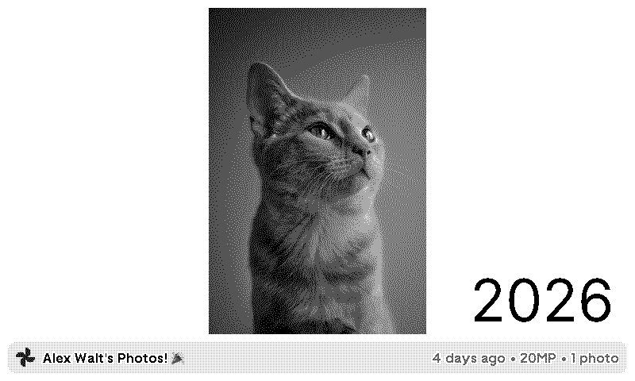         | 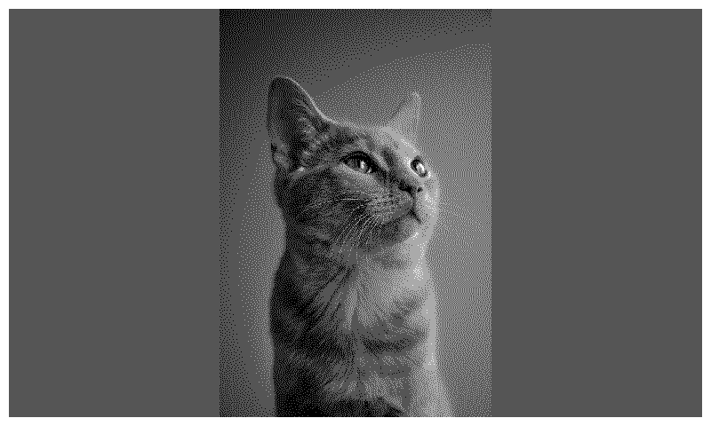           |
| 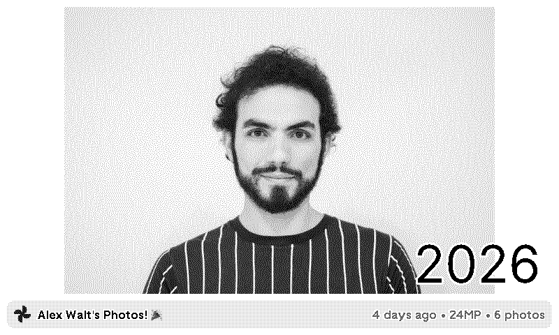 | 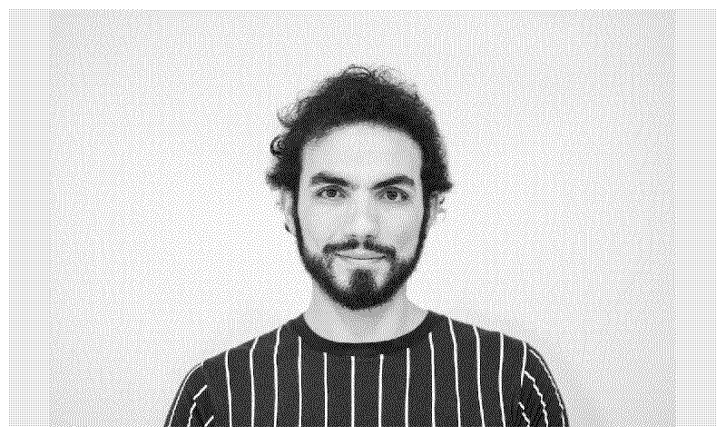 |
| 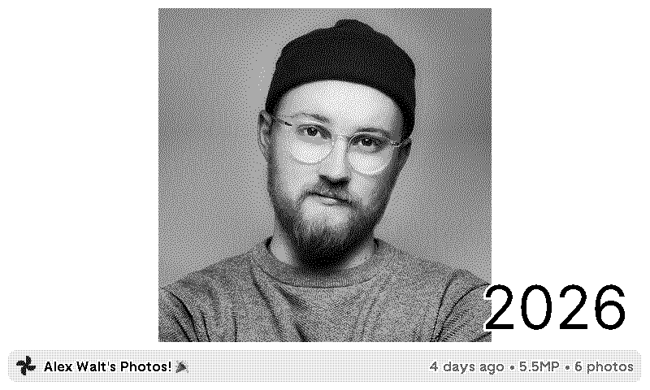 |  |
| 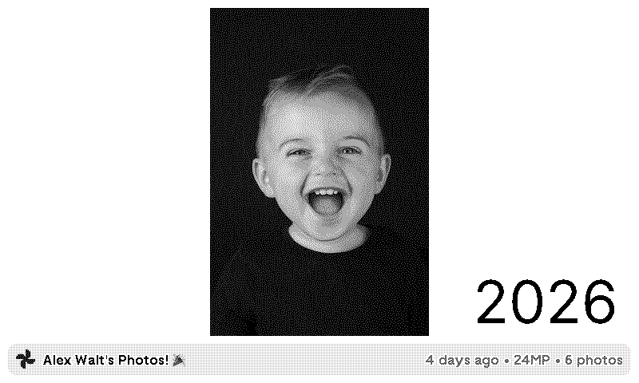 | 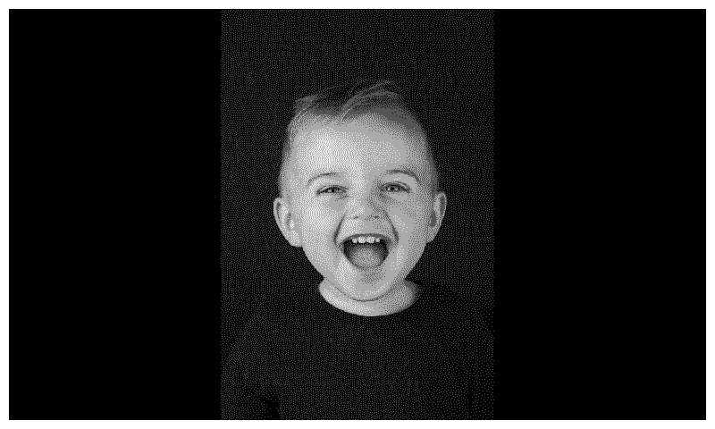 |
| 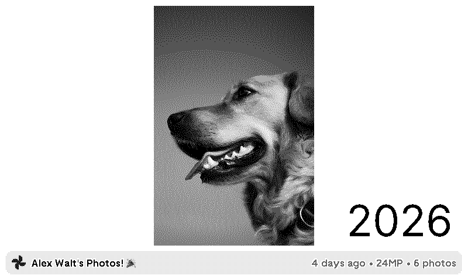      | 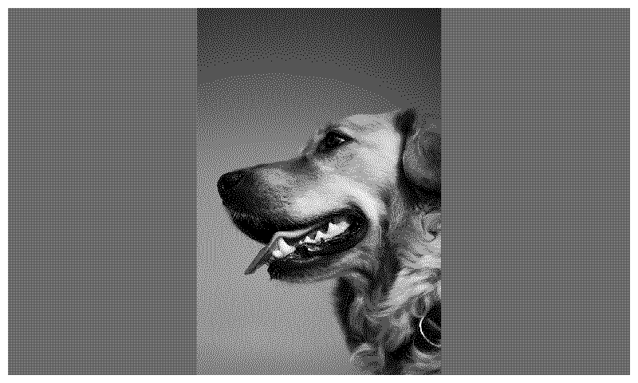      |
| 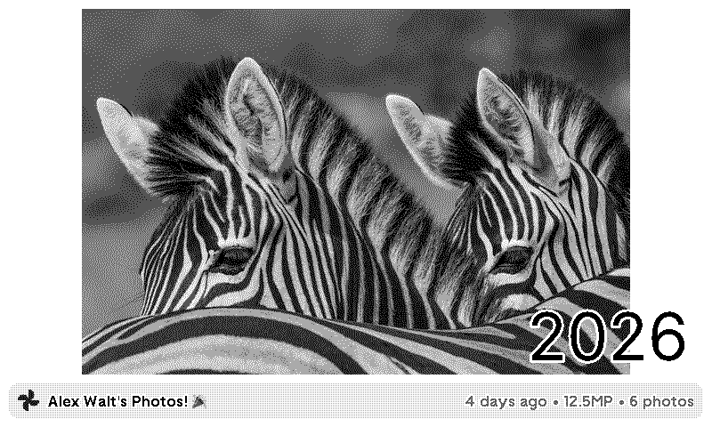       | 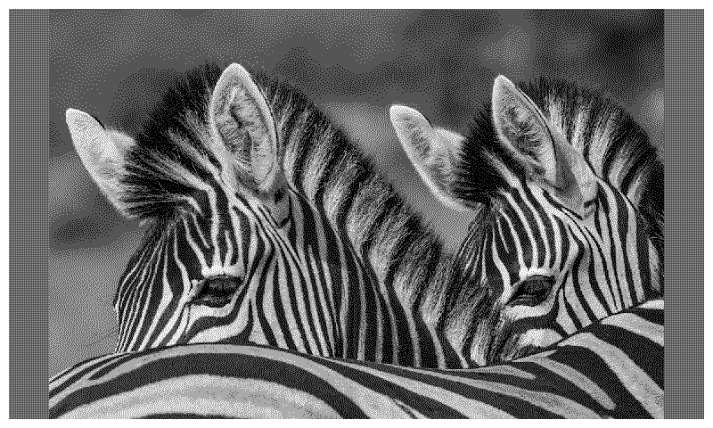       |
